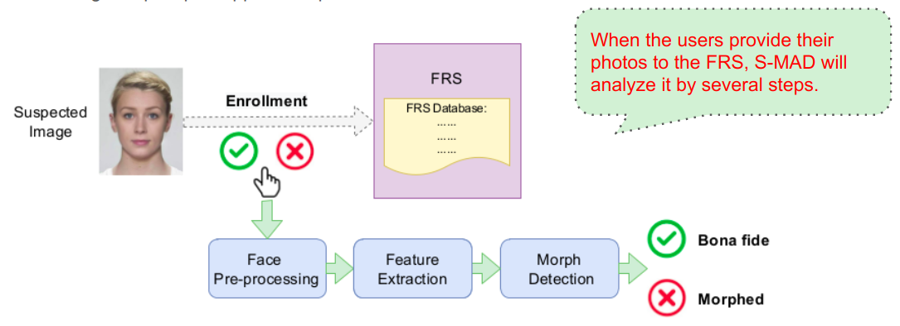
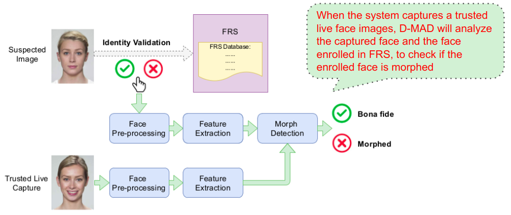
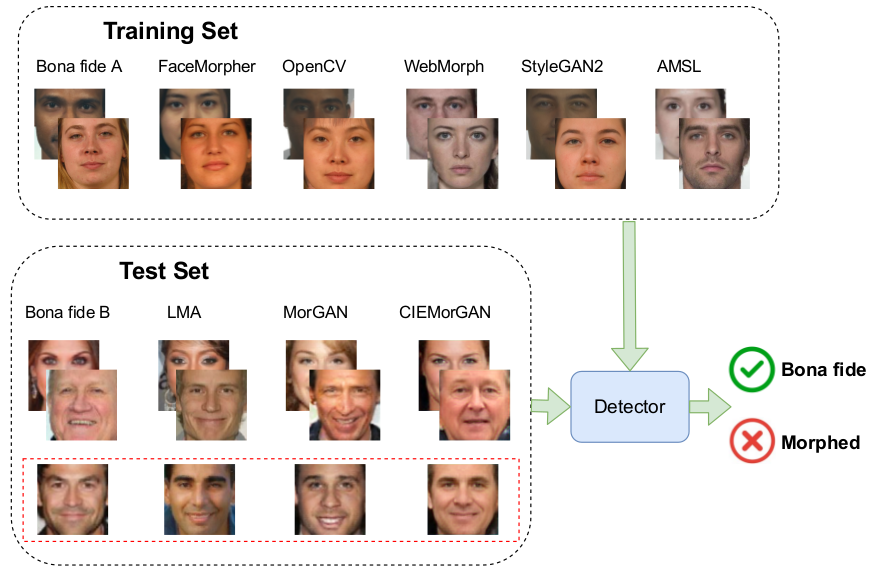
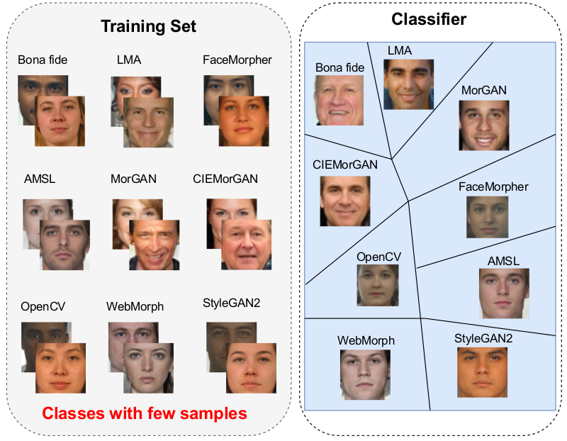
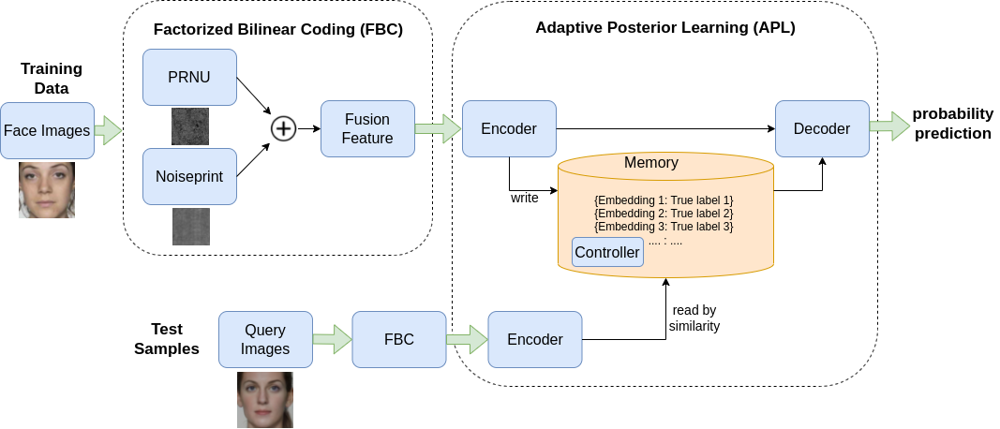
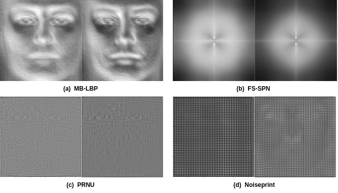
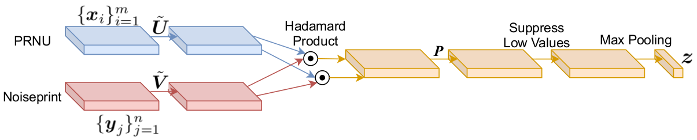
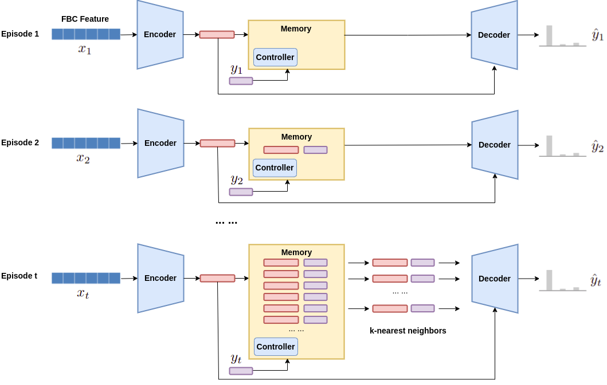

# FBC-APL: A Camera Fingerprint based Morphing Detection and Fingerprinting Model
This is the repository of the paper: Fusion-based Few-Shot Morphing Attack Detection and Fingerprinting, including codes, data and pre-trained model.

Stay tuned for the updating !!!

### link:

[[PDF]](https://arxiv.org/pdf/2210.15510.pdf)
[[Arxiv]](https://arxiv.org/abs/2210.15510)

# Abstract
* This is an implementation of few-shot learning based morphing attacks detection model, and is extended from binary detection to multiclass fingerprinting.
* The model aims at learning discriminative features which can be generalized to unseen morphing attack types from predefined presentation attacks.
* A large-scale face morphing database is collected, which contains 5 face subdatasets and 8 different morphing algorithms, to benchmark the proposed method.

# Introduction
Morphing Defense aims at detecting morphing attacks. Since a malicious person can successfully pass the system’s check, as the facial feature of morphed image resembles the face enrolled in the system, the detection of face morphing attack is becoming an urgent problem to be resolved in order to protect the security of FRS

The existing approaches can be coarsely categorized in two types with respect to the considered morph detection scenario: 
* single image based MAD (S-MAD), i.e. no-reference morph detection;

The Fig. shows a basic S-MAD method focusing on a single potentially morphed image presented to the algorithm. 
The detection action occurs during FRS enrollment stage, e.g. the passport application process. 
When the user provides his photo image to the system, the image is analyzed by MAD method by preprocessing, feature extraction, and classification.

* differential image based MAD (D-MAD), i.e. reference based detection.

This Fig. is a basic D-MAD method to distinguish morphed and bona fide face images, with a corresponding face image captured in a trusted environment. 
The detection action occurs at the time of identity validation, e.g. passing through an Automated Border Control (ABC) gates at borders.
When the system captures a trusted live face image, MAD method will analyze the captured face and face enrolled in the system to check the enrolled image is fake or real.

Our work focus on Single image based MAD scenario.

# Method
We formulate detection / fingerprinting  as few-shot learning problems.

1. Face morphing attack detection: FSL-MAD 

Train the detector using data from both predefined models and new attack models (only a few samples are required) to predict unknown test samples. 
Here, predefined types mean the morphing types occur in training set. 
New types mean the ones occur in test data.
As illustrated in the Fig, few-shot MAD learning aims at learning general discriminative features, which can be generalized from predefined to new attack models. 
Few-shot MAD is to train the detector on the training set and very few collected faces (the red box) in the test set to train the detector, and test it on other faces of the test set.

2. Face morphing attack fingerprinting: FSL-MAF:

In addition to detecting the presence of morphing attacks, we also explore a finer-granularity classification.
It aims at classifying different types of attacks from a few samples. 
The problem is closely related to camera identification (ID), camera model fingerprinting, and GAN fingerprinting (a.k.a. model attribution) in the literature. 

# Pipeline
We designed a fusion-based FSL model for both problems.
It contains two stages: feature extraction and few-shot learning (FSL). 
For feature extraction, we adopt two sensor noise pattern features: PRNU and Noisprint, and fuse them using factorized bilinear coding (FBC) strategy.
The fusion feature are fed into FSL model: Adaptive posterior learning (APL), for probability prediction.

# 1. features extraction

We know that noise is often embedded into image during manipulation. 
Here, we consider two types of sensor noise patterns: PRNU and Noiseprint.
The Fig shows the average features extracted from 1000 randomly selected face images. 
Left column is bona fide; Right column is morphed face.
The study shows morphing-related image manipulation does leave evident traces in PRNU and Noiseprint
It suggests it is feasible to use sensor noise pattern to detect morphing attacks.

* PRNU: handcrafted sensor pattern noise extractor
* Noiseprint: a CNN-based camera model fingerprint
* 

left: bona fide; right: morphed faces.

# 2. feature fusion
We use Factorized Bilinear Coding (FBC) to fuse prnu and noiseprint.

FBC is a  sparse coding formulation.
It can generate a compact and discriminative representation by learning a dictionary.
The dictionary can capture the structure of the whole data space.

The key idea behind FBC is to encode the extracted features based on sparse coding and to learn a dictionary B with k atoms by matrix factorization. 

Specifically, FBC opts to encode the two input features (xi , yj ) into FBC code Cv.
Here, xi, yj are PRNU, and Noiseprint (input features).
Cv is the final fusion feature.
In essence, the bilinear feature dot(xi,yjT) is reconstructed.

# 3. few-shot learning
The fusion feature are then fed into a few-shot learning network for probability prediction.

The idea is to predict the probability by remembering the most surprising features it has encountered.
Here, surprise means: 
the higher the probability the model assigns to the true class correctly, the less surprised it will be. 

It consists of three parts: encoder, decoder, and memory store. 
* encoder: is used to generate a code for the incoming query data;
* memory: saves the previously seen codes and corresponding labels.
If a code is surprising, it will be written in memory; otherwise it will be discarded.
It is key-value data with code and true label.
k-nearest neighbors is used to find top k similar items of queries.
* decoder: will generate a probability distribution over targets by analyzing the query representation and pairwise data returned from the memory. 

# Content
* feature extraction (PRNU, Noiseprint)
* fusion
* few-shot learning
